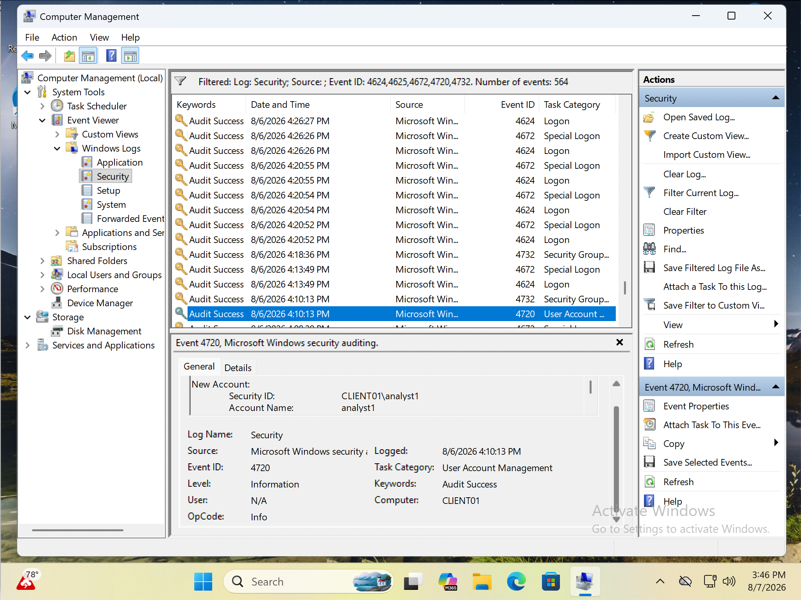
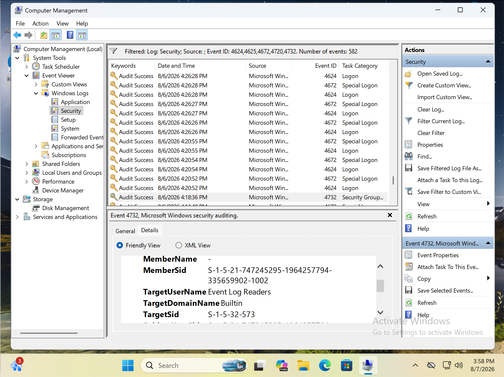
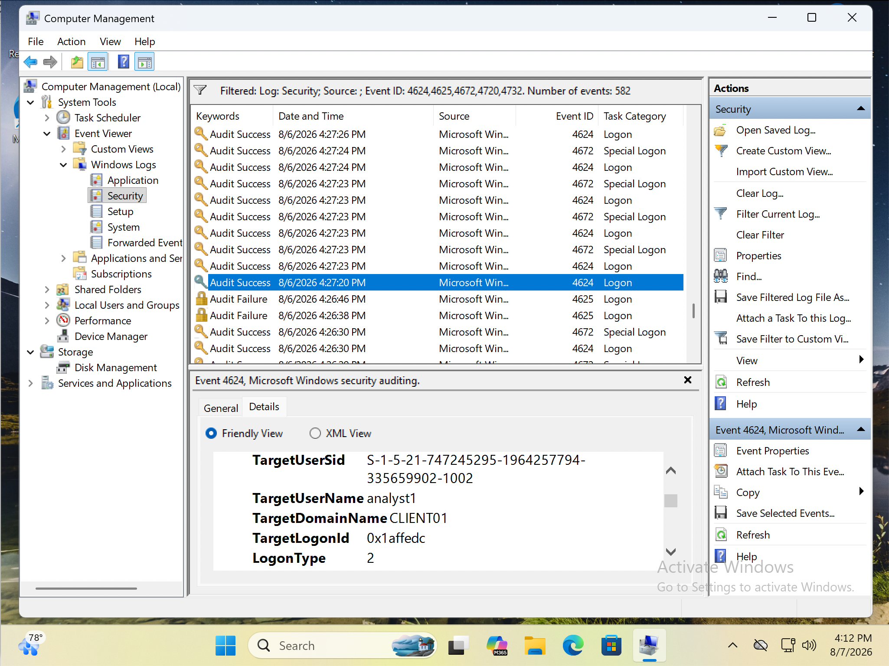

# Windows Event Log Analysis Lab

## Objective

This lab demonstrates how to create a Windows user account, assign security group permissions, and verify the activity through Windows Security Event Logs using Event Viewer.

---

## Skills Practiced

- Windows Event Viewer
- Security Event Log Analysis
- Windows User Account Management
- Security Group Management
- Event ID Investigation
- Windows Audit Logging

---

## Tools Used

- Windows 11
- Computer Management
- Event Viewer
- Local Users and Groups

---

## Events Investigated

| Event ID | Description |
|----------|-------------|
| 4720 | User account created |
| 4732 | User added to Event Log Readers group |
| 4624 | Successful user logon |

---

## Lab Workflow

1. Created a new local user account named **analyst1**.
2. Added the account to the **Event Log Readers** group.
3. Logged into the system using the new account.
4. Verified each action through Windows Security Event Logs.

---

## Screenshots

### User Account Creation

### Group Membership Added

### Successful Logon

---

## Outcome

The lab successfully demonstrated how Windows records account creation, security group membership changes, and successful user logons through Security Event Logs.